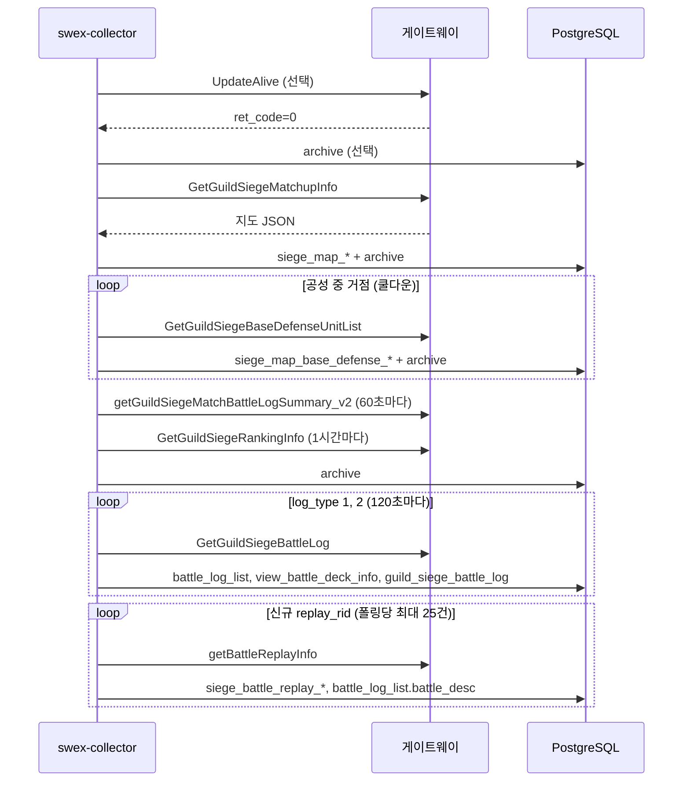

# 점령전 프록시 수집기 DB 적재 명세서 (SMWR 연동)

**대상 독자:** SMWR WAS·DB·프론트 담당자, 운영  
**수집 프로그램:** `summoners_war_swex` (Spring Boot, `swex-collector`)  
**관련 문서:** [siege-map-db-ingest-spec.md](./siege-map-db-ingest-spec.md) (지도 스냅샷 1차 명세)  
**문서 버전:** 2026-05-18

---

## 1. 개요

점령전 진행 중 **게임 계정 1개**로 Com2uS 게이트웨이 API를 주기 호출하고, 응답을 SMWR PostgreSQL에 적재한다.

| 구분 | 설명 |
|------|------|
| 목적 | SWEX 수동 업로드 없이 **실시간 지도·전투 로그·리플레이(메모 포함)·API 원본** 보관 |
| DB | SMWR와 **동일** PostgreSQL (`summonerswar`) |
| `source` 기본값 | `proxy_collector` (`sw.siege.ingest-source`) |
| RTA 수집 | 별도 (`sw.rta.enabled`). 점령전과 **설정·계정 분리** |

### 1.1 SMWR에서 이미 쓰는 기능 vs 수집기

| 기능 | 데이터 경로 | 수집기 |
|------|-------------|--------|
| 지도 `/siege/map` | `siege_map_*` | ✅ Matchup + (선택) BaseDefense |
| 공성 업로드 `/siege-upload` | `battle_log_list`, `guild_siege_battle_log`, `view_battle_deck_info` | ✅ BattleLog (동일 중복 규칙) |
| 리플레이·전투 메모 | **신규** `siege_battle_replay_*`, `battle_log_list.battle_desc` | ✅ Replay |
| API 원본 감사/복구 | **신규** `siege_collector_api_archive` | ✅ Archive |

---

## 2. DDL 적용 순서 (필수)

운영 DB에 **아래 순서로 1회** 적용한다.

| 순서 | 파일 | 용도 |
|------|------|------|
| 1 | `SMWR_WAS/sql/ddl/migrate_siege_map_snapshot.sql` | 지도 스냅샷 |
| 2 | `SMWR_WAS/sql/ddl/migrate_siege_map_base_defense.sql` | 거점 방덱 |
| 3 | `SMWR_WAS/sql/ddl/migrate_siege_collector_full_storage.sql` | 전투 로그 확장·리플레이·API 아카이브 |

```bash
psql -h <host> -p <port> -U postgres -d summonerswar \
  -f SMWR_WAS/sql/ddl/migrate_siege_map_snapshot.sql
psql ... -f SMWR_WAS/sql/ddl/migrate_siege_map_base_defense.sql
psql ... -f SMWR_WAS/sql/ddl/migrate_siege_collector_full_storage.sql
```

수집기 저장소 동일 파일: `summoners_war_swex/sql/ddl/migrate_siege_collector_full_storage.sql`

---

## 3. 수집 API·주기·저장 테이블

### 3.1 폴링 1회 흐름 (기본 30초, `sw.siege.polling-interval-ms`)



### 3.2 API 상세

| API | Request 핵심 필드 | 주기 | 정규화 테이블 | 아카이브 |
|-----|-----------------|------|---------------|----------|
| `UpdateAlive` / `UpdateAlive_V2` | `latency`, `battle` (V1만) | Matchup 직전 매 회 | — | ✅ |
| `GetGuildSiegeMatchupInfo` | `siege_id` | 30초 | `siege_map_*` | ✅ |
| `GetGuildSiegeBaseDefenseUnitList` | `base_number` | 거점당 5분 | `siege_map_base_defense_*` | ✅ |
| `GetGuildSiegeBattleLog` | `log_type` 1·2 | 120초 | `battle_log_list` 등 | ✅ |
| `getBattleReplayInfo` | `replay_rid_ref`, `target_wizard_id` | BattleLog 연동 | `siege_battle_replay_*` | ✅ |
| `getGuildSiegeMatchBattleLogSummary_v2` | `siege_id` | 60초 | — (아카이브만) | ✅ |
| `GetGuildSiegeRankingInfo` | — | 3600초 | — (아카이브만) | ✅ |

### 3.3 `siege_id` 자동 산출

형식 **`YYYYMMWWSS`** (연·월·**일요일 시작 주차**·슬롯 `01`=월 점령 `02`=목 점령).  
수집기: `SiegeIdResolver.resolveNow()`, 설정 `sw.siege.siege-id-auto=true`.

### 3.4 `ts_val` (게이트웨이 세션)

- 요청: `ts_val ≈ unix_sec + 203097464` (`sw.siege.ts-val-offset`)
- 응답 `ts_val`로 동기화 후 요청마다 +1
- **`session_key` 만료 시** `ret_code` 1004·2003 — SWEX에서 **게임 접속 유지** 후 Request 재복사 필수

---

## 4. 테이블·컬럼 (SMWR 소비 가이드)

### 4.1 지도 (기존, 변경 없음)

[siege-map-db-ingest-spec.md](./siege-map-db-ingest-spec.md) §3~§4 참고.

- `siege_map_match`, `siege_map_snapshot`, `siege_map_snapshot_guild`, `siege_map_snapshot_base`
- SMWR API: `GET /api/v1/summonerswar/siege-map/...`

### 4.2 거점 방덱 (기존, 변경 없음)

- `siege_map_base_defense_capture` 및 자식 5테이블
- SMWR API: `GET .../siege-map/{matchId}/bases/{baseNumber}`

### 4.3 전투 로그 (기존 테이블 **컬럼 확장**)

**테이블:** `battle_log_list`, `view_battle_deck_info`, `guild_siege_battle_log`

**중복 키 (siege-upload와 동일):**

```
log_timestamp | wizard_id | opp_wizard_id  (match_id는 매치 단위로 이미 고정)
```

**신규·확장 컬럼 (`migrate_siege_collector_full_storage.sql`):**

| 컬럼 | 출처 | SMWR 활용 예 |
|------|------|----------------|
| `replay_rid_ref` | BattleLog `battle_log_list[].replay_rid_ref` | 리플레이 조회·링크 |
| `battle_desc` | Replay `battle_info.desc` (메모) | 전투 목록 메모 표시 |
| `api_payload` | BattleLog 항목 **JSON 전체** | 필드 추가 시 소급 파싱 |
| `siege_id`, `match_score_var`, `wizard_level`, … | BattleLog 동명 필드 | 필터·표시 |
| `guild_siege_battle_log.api_payload` | `guild_info_list[]` 원본 | 3파전 길드 메타 보존 |

**적재 규칙:**

- `guild_siege_battle_log`: `match_id`당 **최초 1회**만 INSERT (기존 업로드와 동일)
- `defense_deck_status_list` 중복 `(base_number, deck_id)` → 최신 `battle_start_time` 1건만 (수집기 내부 dedupe)

### 4.4 리플레이 (신규)

| 테이블 | PK | 내용 |
|--------|-----|------|
| `siege_battle_replay_raw` | `rid` | `battle_desc`, `match_id`, `source`, `inserted_at` |
| `siege_battle_replay_payload` | `rid` | **`getBattleReplayInfo` 응답 JSON 전체** (`payload` jsonb) |

**조회 예 (메모·덱):**

```sql
SELECT r.rid, r.battle_desc,
       p.payload->'replay_info'->'battle_info'->>'wizard_name' AS atk,
       p.payload->'replay_info'->'battle_info'->'unit_list' AS atk_units
  FROM siege_battle_replay_raw r
  JOIN siege_battle_replay_payload p ON p.rid = r.rid
 WHERE r.rid = 2621117;
```

**`battle_log_list` 연동:**

```sql
SELECT b.log_id, b.log_timestamp, b.wizard_name, b.battle_desc, b.replay_rid_ref
  FROM battle_log_list b
 WHERE b.match_id = '2026050401000008'
 ORDER BY b.log_timestamp DESC;
```

### 4.5 API 응답 아카이브 (신규)

**테이블:** `siege_collector_api_archive`

| 컬럼 | 설명 |
|------|------|
| `command` | 예: `GetGuildSiegeMatchupInfo` |
| `captured_at` | 응답 `tvalue` (unix 초) |
| `match_id`, `siege_id`, `log_type`, `base_number`, `replay_rid` | 조회용 차원 |
| `payload` | **응답 루트 JSON 전체** (jsonb) |
| `source` | `proxy_collector` 등 |

**유니크:** `(command, match_id, replay_rid, base_number, log_type, captured_at)` — 동일 초 재수집 시 1행.

**SMWR 활용:** 신규 필드 분석·버그 복구·Summary/Ranking UI 추가 시 **재배포 없이** jsonb 파싱.

---

## 5. 수집기 설정 (`application.properties`)

```properties
sw.siege.enabled=true
sw.siege.db.enabled=true
sw.siege.db.url=jdbc:postgresql://...
sw.siege.collect.wizard-id=
sw.siege.collect.session-key=          # SWEX 최신값, 만료 시 갱신
sw.siege.collect.proto-ver=
sw.siege.collect.infocsv=
sw.siege.collect.channel-uid=

sw.siege.siege-id-auto=true
sw.siege.ts-val-offset=203097464
sw.siege.polling-interval-ms=30000
sw.siege.ingest-source=proxy_collector

sw.siege.session.update-alive-enabled=true
sw.siege.battle-log.enabled=true
sw.siege.battle-log.log-types=1,2
sw.siege.battle-log.cooldown-ms=120000
sw.siege.replay.enabled=true
sw.siege.replay.max-fetch-per-poll=25
sw.siege.archive.enabled=true
sw.siege.extra-apis.match-summary-enabled=true
sw.siege.extra-apis.ranking-enabled=true
sw.siege.base-defense.enabled=true
sw.siege.base-defense.cooldown-ms=300000
```

RTA와 동시 기동 시 `sw.rta.enabled` / `sw.siege.enabled` 각각 제어.

---

## 6. SMWR WAS API (구현됨)

| API | 경로 | 설명 |
|-----|------|------|
| 매치 전투 로그 | `POST /api/v1/summonerswar/siege-collector-battle-log-list` | `battle_desc`, `replay_rid_ref`, `from_collector` |
| 리플레이 상세 | `POST /api/v1/summonerswar/siege-collector-battle-replay` | `rid` → `siege_battle_replay_payload` |
| API 아카이브 | `POST /api/v1/summonerswar/siege-collector-api-archive-latest` | `command`, `match_id` (Ranking/Summary 등) |

(동일 경로가 `SiegeCollectorController` `/siege-collector/*` 에도 있음 — 배포 시 둘 중 하나 사용.)

프론트: `/siege/map/{matchId}` 하단 **매치 전투 로그** 패널, 거점 선택 시 해당 거점 필터.

HTTP 업로드(`POST /siege-upload`)와 **병행 가능**. 동일 `match_id`·동일 전투 dedup 키면 수집기는 **INSERT 스킵** (업로드 데이터 유지).

---

## 7. 운영·장애

| 증상 | 원인 | 조치 |
|------|------|------|
| `ret_code=2003` | 세션 만료·점령 종료·siege_id 불일치 | SWEX Request 갱신, 점령 중 계정 확인 |
| `bad SQL grammar` / relation 없음 | DDL 미적용 | §2 DDL 3종 적용 |
| `duplicate key` (deck_status) | API 중복 행 | 수집기 최신 버전 (dedupe·ON CONFLICT) |
| BaseDefense 로그 깨짐 | 복호화 실패 | 수집기 `SwGatewayClient` JSON 검증 버전 |
| Replay 미적재 | `replay_rid_ref=0` 또는 한도 | `max-fetch-per-poll`·쿨다운 조정 |

**계정:** 점령전 참가 길드원 1명, 게임 **접속 유지** 권장. `session_key`는 수시 만료.

---

## 8. 검증 체크리스트

### 8.1 DB

- [ ] DDL 3종 적용 완료
- [ ] Matchup 후 `siege_map_snapshot` 행 증가 (30초마다 `captured_at` 다름)
- [ ] `battle_log_list.replay_rid_ref` NOT NULL 행 존재
- [ ] `siege_battle_replay_payload` 에 `battle_info.desc` 메모 포함 JSON
- [ ] `siege_collector_api_archive` 에 `GetGuildSiegeMatchupInfo` 행 증가

### 8.2 SMWR UI (기존)

- [ ] `/siege/map/history` 매치 노출
- [ ] `/siege/map/{matchId}` 지도·거점·타이머
- [ ] (선택) 거점 방덱 API

### 8.3 수집기 로그

- [ ] `[siege] Matchup 요청` → `ret_code=0`
- [ ] `[siege-blog] 신규 전투 로그`
- [ ] `[siege-replay] ... 저장(메모·payload 포함)`

---

## 9. ER 개요 (전체)

```
siege_map_match
  └── siege_map_snapshot
        ├── siege_map_snapshot_guild
        └── siege_map_snapshot_base

siege_map_base_defense_capture
  ├── siege_map_base_defense_wizard / deck / unit / deck_assign / deck_status

guild_siege_battle_log (+ api_payload)
battle_log_list (+ replay_rid_ref, battle_desc, api_payload, …)
  └── view_battle_deck_info

siege_battle_replay_raw
  └── siege_battle_replay_payload (jsonb)

siege_collector_api_archive (jsonb, 시계열)
```

---

## 10. 저장소·클래스 매핑

| 수집기 모듈 | 패키지/클래스 |
|-------------|----------------|
| 스케줄 | `SiegeMapScheduler` |
| 오케스트레이션 | `SiegeCollectorService` |
| 게이트웨이 | `SwGatewayClient` |
| Matchup | `SiegeMapMatchupIngestService` |
| BaseDefense | `SiegeMapBaseDefenseIngestService` |
| BattleLog | `SiegeBattleLogIngestService` |
| Replay | `SiegeBattleReplayIngestService` |
| Archive | `SiegeApiArchiveIngestService` |

**프로젝트 경로:** `c:\project\summoners_war_swex` (또는 배포 JAR `swex-collector`)

---

## 11. 문서 이력

| 날짜 | 내용 |
|------|------|
| 2026-05-18 | 최초 작성: 프록시 수집기 전량 보관·SMWR 연동 명세 |
| 2026-05-18 | `siege-map-db-ingest-spec.md` 와 역할 분리 (지도 1차 vs 프록시 전체) |

**문의:** DDL·필드 변경은 `SMWR_WAS/sql/ddl/` 에 반영 후 수집기 `summoners_war_swex` 동기화.
